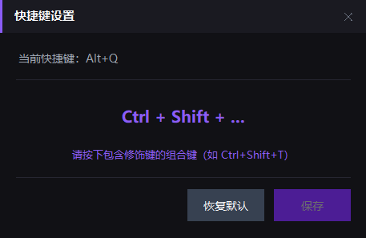
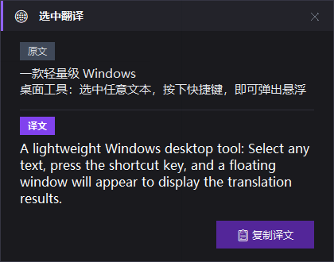

# 选中翻译 — Windows 快捷翻译工具

一款轻量级 Windows 桌面工具：选中任意文本，按下快捷键，即可弹出悬浮窗显示翻译结果。

## 📸 预览





## ✨ 功能特点

- 🌐 **一键翻译** — 选中文本，按下快捷键即可翻译
- ⌨️ **自定义快捷键** — 支持自定义翻译快捷键，通过托盘菜单设置
- 🔄 **智能方向** — 自动识别中文→英文 / 英文→中文
- 🔌 **离线工作** — 使用腾讯 Hy-MT2-1.8B 模型，下载模型后无需联网
- ⚡ **高性能** — 基于 llama.cpp 推理引擎，CPU 多线程加速
- 🎨 **现代 UI** — 深色半透明悬浮窗，毛玻璃风格
- 📌 **系统托盘** — 后台常驻，不占任务栏空间
- 📋 **一键复制** — 翻译结果支持一键复制到剪贴板
- 🖱️ **智能定位** — 翻译窗口自动跟随鼠标位置

## 🛠️ 技术栈

| 组件 | 技术 | 说明 |
|------|------|------|
| 翻译引擎 | llama-cpp-python + Hy-MT2-1.8B-GGUF | 高质量中英文翻译模型 |
| GUI 框架 | tkinter | 轻量级跨平台 GUI |
| 热键监听 | pynput | 全局快捷键捕获 |
| 系统托盘 | pystray | 系统托盘图标管理 |
| 剪贴板 | pyperclip | 剪贴板读写操作 |
| 图像处理 | Pillow | 托盘图标生成 |
| 模型下载 | huggingface_hub | 从 HuggingFace 下载模型 |

## 📦 安装

### 1. 安装 Python 依赖

```bash
pip install -r requirements.txt
```

**注意**：`llama-cpp-python` 可能需要 C++ 编译环境。如果安装失败，请参考以下说明：

#### Windows 安装 llama-cpp-python

**方法一：使用预编译的 wheel（推荐）**
```bash
pip install llama-cpp-python --extra-index-url https://abetlen.github.io/llama-cpp-python/whl/cpu
```

**方法二：从源码编译**
1. 安装 Visual Studio Build Tools（包含 C++ 编译器）
2. 或者安装 MinGW-w64
3. 然后运行：`pip install llama-cpp-python`

### 2. 首次运行（下载模型）

首次启动时会自动下载 Hy-MT2-1.8B GGUF 模型（约 1.13GB），需要联网。
下载完成后即可离线使用。

```bash
python main.py
```

## 🚀 使用方法

1. 运行 `python main.py`，工具会最小化到系统托盘
2. 在任意应用中 **选中文本**
3. 按下默认快捷键 `Ctrl+Alt+Q`（可自定义）
4. 翻译结果会在鼠标附近弹出悬浮窗

### 快捷操作

| 操作 | 说明 |
|------|------|
| `Ctrl+Alt+Q` | 翻译选中文本（默认快捷键，可自定义） |
| `Esc` | 关闭翻译窗口 |
| 点击窗口外部 | 关闭翻译窗口 |
| 拖拽标题栏 | 移动翻译窗口 |
| 点击「复制译文」 | 复制翻译结果到剪贴板 |

### 自定义快捷键

1. 右键点击系统托盘图标
2. 选择「设置快捷键」
3. 在弹出的设置窗口中按下新的快捷键组合（如 `Ctrl+Shift+T`）
4. 点击「保存」按钮，快捷键立即生效
5. 设置会自动保存，下次启动时自动加载

## 🏗️ 项目结构

```
translate-plugin/
├── main.py              # 主入口，协调各模块
├── translator.py        # Hy-MT2 翻译引擎封装（llama.cpp）
├── hotkey_manager.py    # 全局热键管理
├── popup_window.py      # 悬浮翻译窗口（tkinter）
├── tray_icon.py         # 系统托盘图标（pystray）
├── config_manager.py    # 配置管理（快捷键设置持久化）
├── settings_window.py   # 快捷键设置对话框
├── models/              # 模型存储目录（自动创建）
├── settings.json        # 用户配置文件（自动生成）
├── requirements.txt     # Python 依赖
├── test_llama_cpp.py    # llama.cpp 集成测试脚本
└── README.md            # 项目说明
```

## 🔧 测试

运行测试脚本验证 llama.cpp 集成：

```bash
python test_llama_cpp.py
```

## ⚠️ 注意事项

- 需要 **Python 3.10+**
- `pynput` 库在某些情况下可能需要 **管理员权限** 才能捕获全局热键
- 首次运行需要联网下载 Hy-MT2-1.8B GGUF 模型（约 1.13GB）
- 翻译质量基于腾讯 Hy-MT2-1.8B 模型，支持中英文高质量互译
- 模型使用 Q4_K_M 量化，在保证质量的同时减少内存占用
- 默认使用 CPU 多线程推理，无需 GPU
- 自定义快捷键设置会自动保存到 `settings.json` 文件中
- 已优化高 DPI 显示器支持，文字显示清晰且大小合适

## 📊 模型信息

| 属性 | 值 |
|------|-----|
| 模型名称 | 腾讯 Hy-MT2-1.8B |
| 模型格式 | GGUF (Q4_K_M 量化) |
| 模型大小 | 约 1.13GB |
| 支持语言 | 中英文互译 |
| 推理引擎 | llama.cpp |
| 加速方式 | CPU 多线程 |
| 上下文窗口 | 4096 tokens |

## 🐛 故障排除

### 1. llama-cpp-python 安装失败

**问题**：`pip install llama-cpp-python` 报错
**解决方案**：
- 使用预编译的 wheel（推荐）：
  ```bash
  pip install llama-cpp-python --extra-index-url https://abetlen.github.io/llama-cpp-python/whl/cpu
  ```
- 或安装 Visual Studio Build Tools 后重新安装

### 2. 模型下载失败

**问题**：首次运行时模型下载失败
**解决方案**：
- 检查网络连接
- 尝试使用 HuggingFace 镜像：
  ```bash
  set HF_ENDPOINT=https://hf-mirror.com
  python main.py
  ```
- 或手动下载模型文件到 `models/Hy-MT2-1.8B-GGUF/` 目录

### 3. 翻译速度慢

**问题**：翻译响应时间过长
**解决方案**：
- 确保使用 CPU 多线程（默认启用）
- 检查系统 CPU 使用率，关闭其他占用 CPU 的程序
- 考虑使用更小的量化版本（如 Q2_K）

### 4. 热键无响应

**问题**：按下快捷键没有反应
**解决方案**：
- 以管理员权限运行程序
- 检查是否有其他软件占用了相同快捷键
- 通过托盘菜单重新设置快捷键
- 查看日志文件 `translate.log` 获取详细信息

### 5. 翻译结果为空

**问题**：翻译窗口显示但没有结果
**解决方案**：
- 检查选中的文本是否有效
- 查看日志文件 `translate.log` 获取错误信息
- 尝试重启程序

## 📝 开发说明

### 核心模块

1. **translator.py** - 翻译引擎
   - 使用 `llama-cpp-python` 加载 GGUF 模型
   - 支持自动下载模型（通过 `huggingface_hub`）
   - 提供同步和异步翻译接口
   - 自动检测翻译方向（中→英 / 英→中）

2. **hotkey_manager.py** - 热键管理
   - 使用 `pynput` 监听全局快捷键
   - 通过模拟 Ctrl+C 获取选中文本
   - 支持自定义快捷键

3. **popup_window.py** - 悬浮窗口
   - 使用 `tkinter` 实现无边框窗口
   - 支持淡入动画和自动定位
   - 深色主题，现代 UI 风格

4. **tray_icon.py** - 系统托盘
   - 使用 `pystray` 管理系统托盘图标
   - 显示翻译状态和快捷键信息
   - 提供设置快捷键和退出菜单

5. **config_manager.py** - 配置管理
   - 管理用户配置（快捷键等）
   - 配置持久化到 `settings.json`
   - 支持默认配置和用户配置合并

6. **settings_window.py** - 设置窗口
   - 快捷键设置对话框
   - 支持实时捕获键盘输入
   - 深色主题，与主界面风格一致

### 配置参数

翻译参数可在 `translator.py` 中调整：

```python
GENERATION_CONFIG = {
    "temperature": 0.7,      # 生成温度
    "top_p": 0.6,           # 核采样参数
    "top_k": 20,            # Top-K 采样
    "repeat_penalty": 1.05, # 重复惩罚
    "max_tokens": 4096,     # 最大生成长度
}
```

用户配置保存在 `settings.json` 文件中：

```json
{
  "hotkey": "<ctrl>+<shift>+t",
  "hotkey_display": "Ctrl+Shift+T"
}
```

### 扩展开发

如需添加其他语言支持：
1. 下载对应的 GGUF 模型
2. 修改 `translator.py` 中的 `MODEL_ID` 和 `MODEL_FILENAME`
3. 更新 `PROMPT_TEMPLATE` 以支持新的语言对

## 📄 许可证

本项目采用 MIT 许可证。详见 [LICENSE](LICENSE) 文件。

## 🙏 致谢

- [llama.cpp](https://github.com/ggerganov/llama.cpp) - 高性能 LLM 推理引擎
- [llama-cpp-python](https://github.com/abetlen/llama-cpp-python) - Python 绑定
- [腾讯 Hy-MT2](https://huggingface.co/tencent/Hy-MT2-1.8B-GGUF) - 中英文翻译模型
- [pynput](https://github.com/moses-palmer/pynput) - 跨平台输入监控
- [pystray](https://github.com/moses-palmer/pystray) - 系统托盘图标库