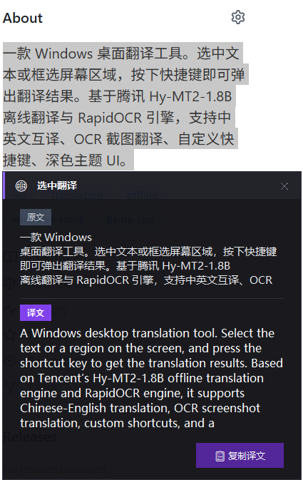
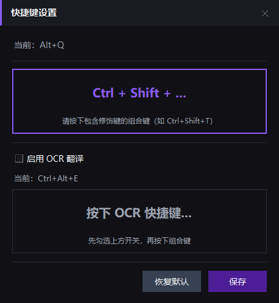

# 选中翻译 — Windows 快捷翻译工具

一款 Windows 桌面翻译工具。选中文本或框选屏幕区域，按下快捷键即可弹出翻译结果。基于腾讯 Hy-MT2-1.8B 离线翻译与 RapidOCR 引擎，支持中英文互译、OCR 截图翻译、自定义快捷键、深色主题 UI。

## 📸 预览





## ✨ 功能特点

- 🌐 **一键翻译** — 选中文本，按下快捷键即可翻译
- 🖼️ **OCR 截图翻译** — 框选屏幕区域，识别图片/视频/PDF 中的文字并翻译
- ⌨️ **自定义快捷键** — 翻译与 OCR 各自独立快捷键，通过托盘菜单设置
- 🔄 **智能方向** — 自动识别中文→英文 / 英文→中文
- 🔌 **离线工作** — 翻译用腾讯 Hy-MT2-1.8B 模型，OCR 用 RapidOCR，下载模型后无需联网
- ⚡ **高性能** — 翻译基于 llama.cpp 推理引擎，OCR 基于 ONNX Runtime，CPU 多线程加速
- 🎨 **现代 UI** — 深色半透明悬浮窗，毛玻璃风格
- 📌 **系统托盘** — 后台常驻，不占任务栏空间
- 📋 **一键复制** — 翻译结果支持一键复制到剪贴板
- 🖱️ **智能定位** — 翻译窗口自动跟随鼠标位置
- 📏 **自适应高度** — 翻译窗口高度随内容自动调整，支持滚动条
- 🔒 **单实例保护** — 防止程序多开，重复运行时自动提示

## 🛠️ 技术栈

| 组件     | 技术                                | 说明                    |
| -------- | ----------------------------------- | ----------------------- |
| 翻译引擎 | llama-cpp-python + Hy-MT2-1.8B-GGUF | 高质量中英文翻译模型    |
| OCR 引擎 | rapidocr-onnxruntime                | 离线多语种文字识别      |
| GUI 框架 | tkinter                             | 轻量级跨平台 GUI        |
| 热键监听 | pynput                              | 全局快捷键捕获          |
| 系统托盘 | pystray                             | 系统托盘图标管理        |
| 剪贴板   | pyperclip                           | 剪贴板读写操作          |
| 图像处理 | Pillow                              | 托盘图标 / OCR 预处理   |
| 模型下载 | huggingface_hub                     | 从 HuggingFace 下载模型 |

## 📦 安装

### 1. 安装 Python 依赖

```bash
pip install -r requirements.txt
```

**注意**：`llama-cpp-python` 可能需要 C++ 编译环境。如果安装失败，请参考以下说明：

#### Windows 安装 llama-cpp-python

**方法一：使用预编译的 wheel（推荐）**

```bash
pip install llama-cpp-python --extra-index-url https://abetlen.github.io/llama-cpp-python/whl/cpu
```

**方法二：从源码编译**

1. 安装 Visual Studio Build Tools（包含 C++ 编译器）
2. 或者安装 MinGW-w64
3. 然后运行：`pip install llama-cpp-python`

### 2. 首次运行（下载模型）

首次启动时会自动下载 Hy-MT2-1.8B GGUF 模型（约 1.13GB），需要联网。
下载完成后即可离线使用。

```bash
python main.py
```

## 🚀 使用方法

1. 运行 `python main.py`，工具会最小化到系统托盘
2. **选中文本翻译**：在任意应用中选中文本，按下 `Ctrl+Alt+Q`（可自定义）
3. **OCR 截图翻译**：按下 `Ctrl+Alt+E`（可自定义），鼠标框选屏幕区域

### 快捷操作

| 操作             | 说明                                 |
| ---------------- | ------------------------------------ |
| `Ctrl+Alt+Q`     | 翻译选中文本（默认快捷键，可自定义） |
| `Ctrl+Alt+E`     | OCR 截图翻译（默认快捷键，可自定义） |
| `Esc`            | 关闭翻译窗口 / 取消截图框选          |
| 点击窗口外部     | 关闭翻译窗口                         |
| 拖拽标题栏       | 移动翻译窗口                         |
| 点击「复制译文」 | 复制翻译结果到剪贴板                 |

### 自定义快捷键

1. 右键点击系统托盘图标
2. 选择「设置快捷键」
3. 在弹出的设置窗口中：
   - 上方为「翻译快捷键」捕获区，按下新组合键即可
   - 下方为「OCR 快捷键」捕获区（需先开启 OCR 开关）
4. 点击「保存」按钮，快捷键立即生效
5. 设置会自动保存，下次启动时自动加载

### OCR 截图翻译

适用于无法选中文本的场景：图片、视频字幕、PDF、UI 界面等。

1. 在托盘菜单勾选「启用 OCR 翻译」（首次使用会加载模型，约 2-3s）
2. 按 OCR 快捷键进入截图模式
3. 鼠标拖拽框选要识别的区域（选区内清晰，选区外暗化）
4. 松开鼠标，自动识别文字并翻译

## 🏗️ 项目结构

```
translate-plugin/
├── main.py              # 主入口，协调各模块
├── translator.py        # Hy-MT2 翻译引擎封装（llama.cpp）
├── ocr_engine.py        # OCR 引擎（RapidOCR + 截图框选）
├── hotkey_manager.py    # 全局热键管理
├── popup_window.py      # 悬浮翻译窗口（tkinter）
├── tray_icon.py         # 系统托盘图标（pystray）
├── config_manager.py    # 配置管理（快捷键设置持久化）
├── settings_window.py   # 快捷键设置对话框
├── models/              # 模型存储目录（自动创建）
├── settings.json        # 用户配置文件（自动生成）
├── requirements.txt     # Python 依赖
├── build.bat            # Windows 打包入口（调用 build_release.py）
├── build_release.py     # PyInstaller 打包脚本 + ICO 生成器
├── icon.png             # 图标源文件（PNG，透明背景）
├── icon.ico             # 打包用图标（构建时自动生成）
├── test_llama_cpp.py    # llama.cpp 集成测试脚本
└── README.md            # 项目说明
```

## 📦 打包

使用 `build.bat` 可将项目打包为 Windows 可执行文件（.exe），无需 Python 环境即可运行：

```batch
build.bat
```

打包流程：

1. 清理旧的构建文件
2. 使用 PyInstaller 打包 Python 脚本为 exe
3. 拷贝模型文件到输出目录
4. 清理临时文件

打包完成后，可执行文件位于 `dist\选中翻译\` 目录下。

**注意**：打包前请确保已安装 PyInstaller 并完成模型下载。

## 🔧 测试

运行测试脚本验证 llama.cpp 集成：

```bash
python test_llama_cpp.py
```

## ⚠️ 注意事项

- 需要 **Python 3.10+**
- `pynput` 库在某些情况下可能需要 **管理员权限** 才能捕获全局热键
- 首次运行需要联网下载 Hy-MT2-1.8B GGUF 模型（约 1.13GB）
- 翻译质量基于腾讯 Hy-MT2-1.8B 模型，支持中英文高质量互译
- 模型使用 Q4_K_M 量化，在保证质量的同时减少内存占用
- 默认使用 CPU 多线程推理，无需 GPU
- 自定义快捷键设置会自动保存到 `settings.json` 文件中
- 已优化高 DPI 显示器支持，文字显示清晰且大小合适
- 日志写入 `translate.log`，按大小轮转：单文件最大 `10MB`，最多保留 `5` 个历史文件

## 📊 模型信息

| 属性       | 值                 |
| ---------- | ------------------ |
| 模型名称   | 腾讯 Hy-MT2-1.8B   |
| 模型格式   | GGUF (Q4_K_M 量化) |
| 模型大小   | 约 1.13GB          |
| 支持语言   | 中英文互译         |
| 推理引擎   | llama.cpp          |
| 加速方式   | CPU 多线程         |
| 上下文窗口 | 4096 tokens        |

## 🐛 故障排除

### 1. llama-cpp-python 安装失败

**问题**：`pip install llama-cpp-python` 报错
**解决方案**：

- 使用预编译的 wheel（推荐）：
  ```bash
  pip install llama-cpp-python --extra-index-url https://abetlen.github.io/llama-cpp-python/whl/cpu
  ```
- 或安装 Visual Studio Build Tools 后重新安装

### 2. 模型下载失败

**问题**：首次运行时模型下载失败
**解决方案**：

- 检查网络连接
- 尝试使用 HuggingFace 镜像：
  ```bash
  set HF_ENDPOINT=https://hf-mirror.com
  python main.py
  ```
- 或手动下载模型文件到 `models/Hy-MT2-1.8B-GGUF/` 目录

### 3. 翻译速度慢

**问题**：翻译响应时间过长
**解决方案**：

- 确保使用 CPU 多线程（默认启用）
- 检查系统 CPU 使用率，关闭其他占用 CPU 的程序
- 考虑使用更小的量化版本（如 Q2_K）

### 4. 热键无响应

**问题**：按下快捷键没有反应
**解决方案**：

- 以管理员权限运行程序
- 检查是否有其他软件占用了相同快捷键
- 通过托盘菜单重新设置快捷键
- 查看日志文件 `translate.log` 获取详细信息

### 5. 翻译结果为空

**问题**：翻译窗口显示但没有结果
**解决方案**：

- 检查选中的文本是否有效
- 查看日志文件 `translate.log` 获取错误信息
- 尝试重启程序

### 6. 程序提示已运行

**问题**：启动程序时提示"程序已在运行中！"
**解决方案**：

- 检查系统托盘区域是否有翻译工具图标
- 如果需要重新启动，先右键托盘图标选择「退出」
- 或使用任务管理器结束进程后重新启动

## 📝 开发说明

### 核心模块

1. **translator.py** - 翻译引擎
   - 使用 `llama-cpp-python` 加载 GGUF 模型
   - 支持自动下载模型（通过 `huggingface_hub`）
   - 提供同步和异步翻译接口
   - 自动检测翻译方向（中→英 / 英→中）

2. **hotkey_manager.py** - 热键管理
   - 使用 `pynput` 监听全局快捷键
   - 通过模拟 Ctrl+C 获取选中文本
   - 支持自定义快捷键

3. **popup_window.py** - 悬浮窗口
   - 使用 `tkinter` 实现无边框窗口
   - 支持淡入动画和自动定位
   - 深色主题，现代 UI 风格

4. **tray_icon.py** - 系统托盘
   - 使用 `pystray` 管理系统托盘图标
   - 显示翻译状态和快捷键信息
   - 提供设置快捷键和退出菜单

5. **config_manager.py** - 配置管理
   - 管理用户配置（快捷键等）
   - 配置持久化到 `settings.json`
   - 支持默认配置和用户配置合并

6. **settings_window.py** - 设置窗口
   - 快捷键设置对话框
   - 支持实时捕获键盘输入
   - 深色主题，与主界面风格一致

7. **ocr_engine.py** - OCR 引擎
   - 懒加载 RapidOCR（ONNX Runtime）
   - 全屏遮罩 + 鼠标框选截图
   - 图像预处理：灰度 + 自适应缩放 + 暗色模式反转
   - 按需重试 + 文本框几何去重 + 质心聚类分行

### 配置参数

翻译参数可在 `translator.py` 中调整：

```python
GENERATION_CONFIG = {
    "temperature": 0.7,      # 生成温度
    "top_p": 0.6,           # 核采样参数
    "top_k": 20,            # Top-K 采样
    "repeat_penalty": 1.05, # 重复惩罚
    "max_tokens": 4096,     # 最大生成长度
}
```

用户配置保存在 `settings.json` 文件中：

```json
{
  "hotkey": "<ctrl>+<shift>+t",
  "hotkey_display": "Ctrl+Shift+T"
}
```

### 扩展开发

如需添加其他语言支持：

1. 下载对应的 GGUF 模型
2. 修改 `translator.py` 中的 `MODEL_ID` 和 `MODEL_FILENAME`
3. 更新 `PROMPT_TEMPLATE` 以支持新的语言对

## 📄 许可证

本项目采用 MIT 许可证。详见 [LICENSE](LICENSE) 文件。

## 📋 更新日志

### v1.2.0 — 2026-07-01

#### 🖼️ OCR 截图翻译

- **新增 OCR 翻译模式**：针对无法选中文本的场景（图片、视频字幕、PDF、UI 界面等），通过鼠标框选截图区域进行 OCR 识别后翻译
  - 基于 [RapidOCR](https://github.com/RapidAI/RapidOCR) (ONNX Runtime) 离线识别引擎，3 个模型约 15MB，随 pip 包内置无需额外下载
  - 独立第二热键触发（默认 `Ctrl+Alt+E`，可自定义）
  - 设置界面新增 OCR 开关，关闭时不加载模型，零内存占用
  - 懒加载：首次触发时才加载模型（约 2-3s），之后常驻内存
- **专业截图框选体验**：
  - 选区外黑色暗化遮罩，选区内原屏清晰可见（"挖洞"效果）
  - 紫色边框（`#8B5CF6`，与主界面统一）
  - 实时显示选区尺寸 `宽 × 高`
  - 支持多显示器（虚拟桌面坐标）
- **OCR 识别优化**：
  - 图像预处理：灰度化 + 自适应缩放（1.0x/1.5x/2.0x）+ 暗色模式自动反转
  - 按需重试：首轮置信度 < 0.72 时自动放大到 2.0x 重跑
  - 文本框排序：质心聚类分行 → 行间从上到下 → 行内从左到右
  - 几何去重：丢弃重复检测框（加粗大写字母单独检出场景）
  - RapidOCR 参数调优：`det_box_thresh=0.4`、`det_unclip_ratio=2.2`、`use_cls=False`

#### 🐛 修复

- **热键冲突**：两个 `GlobalHotKeys` 监听器共享 `Ctrl+Alt` 前缀导致误触发，合并为单监听器
- **遮罩重复**：OCR 框选防重入保护，避免重复按热键产生多层遮罩
- **鼠标事件吞入**：框选窗口创建后延迟 100ms 绑定鼠标事件，避免吞入按键时的残留鼠标状态

---

### v1.1.0 — 2026-06-30

#### 🎨 图标系统重构

- **修复 exe 图标白底问题**：手动构造 BMP-32 + AND mask 格式 ICO，绕开 Pillow 默认 ICO 写入器的透明度 bug
  - 7 个尺寸（16~256px）全部正确保留 alpha 通道
  - 桌面/资源管理器中 exe 图标透明背景完美渲染
- **托盘图标改用静态 PNG**：替换原动态生成「译」字图标的方案，直接加载 `icon.png`，更清晰且统一品牌
- **窗口图标支持**：主窗口标题栏图标优先使用 PNG，回退到 ICO
- 新增 `icon.png` / `icon.ico` 图标资源文件

#### 🏗️ 构建系统优化

- **重构打包脚本**：`build.bat` 现调用 `build_release.py`，构建逻辑从批处理迁移到 Python
  - 自动从 `icon.png` 生成多尺寸 ICO
  - 路径解析基于 `sys.executable`，不再硬编码 Python 安装路径
  - UTF-8 编码处理更健壮

#### 🔧 其他改进

- 主入口增加窗口图标设置逻辑
- 托盘图标加载失败时回退到纯色占位图

---

### v1.0.0 — 初始版本

- 一键选中文本翻译（Ctrl+Alt+Q）
- 基于腾讯 Hy-MT2-1.8B 离线翻译模型
- 自定义快捷键、系统托盘常驻
- 深色毛玻璃风格悬浮窗
- 单实例保护、日志轮转
- 高 DPI 显示支持

## 🙏 致谢

- [llama.cpp](https://github.com/ggerganov/llama.cpp) - 高性能 LLM 推理引擎
- [llama-cpp-python](https://github.com/abetlen/llama-cpp-python) - Python 绑定
- [腾讯 Hy-MT2](https://huggingface.co/tencent/Hy-MT2-1.8B-GGUF) - 中英文翻译模型
- [pynput](https://github.com/moses-palmer/pynput) - 跨平台输入监控
- [pystray](https://github.com/moses-palmer/pystray) - 系统托盘图标库

### 友情链接

[](https://linux.do/)
