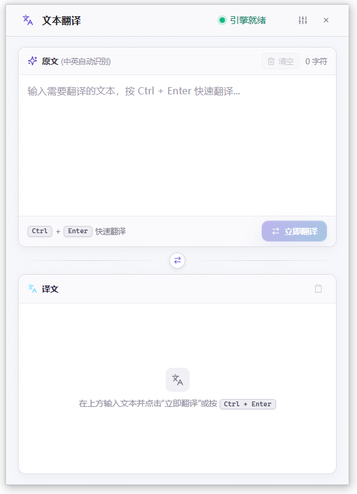
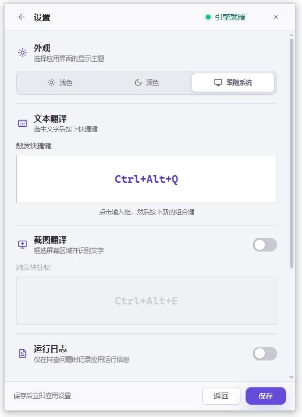

# PopTrans (选中翻译)

<div align="center">

[](https://go.dev/)
[](https://wails.io/)
[](https://python.org/)
[](LICENSE)
[]()
[](https://github.com/ifocus9/PopTrans/releases/latest)

</div>

**PopTrans** 是一款专为 Windows 打造的本地离线翻译与 OCR 工具。支持选中文本或屏幕截图后一键翻译。
基于 Go + Wails 构建流畅的原生交互与现代界面，后端采用 Python 与 llama.cpp 实现纯 CPU 离线大模型推理，**无需 GPU 加速，彻底告别隐私泄露与网络依赖**。

---

## 🌟 核心特性

- **🔒 完全离线 · 隐私优先**：后端基于 llama.cpp 在本地 CPU 上运行腾讯 Hy-MT2-1.8B 大模型，**无需 GPU、无需联网**（模型下载一次后即纯离线），文本不出本机，杜绝隐私泄露。
- **🚀 快捷翻译**：一键捕获选中文本（模拟 Ctrl+C，内置多次智能重试），并即刻显示翻译结果。
- **📷 离线 OCR**：原生 Go 实现的屏幕框选与截图，内置 1.0× / 1.5× / 2.0× 多倍率自动缩放与识别质量回退重试，小字、低分辨率截图也能精准识别。
- **🌐 智能互译**：基于文本中的中英文字符比例自动判断语种，进行中英文双向互译。
- **⚡ 极速响应**：内置 LRU 结果缓存（256 条），重复文本翻译秒级返回。
- **📦 内嵌引擎 · 零环境配置**：AI 引擎通过 PyInstaller 打包为独立 `ai_engine.exe`，**用户无需安装 Python 或任何依赖**，下载解压即用。
- **🎨 现代 UI**：基于 Wails 构建的亚克力毛玻璃（`backdrop-filter` 模糊）界面，完美支持系统深色/浅色主题自适应。
- **🧩 UI 单实例**：设置页与结果弹窗复用同一个 `translate-ui` 进程，减少重复启动与内存抖动。
- **🔧 灵活配置**：系统托盘常驻，支持自定义全局快捷键（Ctrl/Alt/Shift/Win）、OCR 开关、本地端口、UI/AI 空闲退出等，配置热加载即刻生效。
- **🛌 AI 空闲回收**：AI 引擎支持按空闲时间自动退出，降低长时间待机内存占用；下次翻译会自动重新拉起。
- **🔌 开放本地 API**：AI 引擎在 `127.0.0.1:<port>` 提供 OpenAI 兼容的 `/v1/chat/completions` 与 OCR 接口，便于外部工具或脚本二次开发（详见 [本地 API 文档](docs/API.md)）。

---

## 📸 效果预览





---

## 🚀 快速上手 (面向用户)

### 运行环境

- **操作系统**：Windows 10 / 11 (x64)
- **依赖运行库**：需系统已安装 [WebView2 Runtime](https://developer.microsoft.com/zh-cn/microsoft-edge/webview2/) (Windows 11 通常自带)
- **硬件要求**：纯 CPU 推理，无需独立显卡，建议 8GB 及以上内存。

### 下载与安装

[⬇️ 下载最新版本](https://github.com/ifocus9/PopTrans/releases/latest) — 解压后即可使用。

### 首次运行与自动下载

1. 双击运行发行版中的 `PopTrans.exe`。
2. **下载模型**：若本地无翻译模型，首次启动时会**自动联网下载** 腾讯 Hy-MT2-1.8B GGUF 模型 (约 1.13GB)。默认从 HuggingFace 官网 (`huggingface.co`) 下载，请确保网络可正常访问。
3. 下载完成后，模型将保存在 `models/Hy-MT2-1.8B-GGUF/` 目录下，后续运行即为完全离线状态。

### 默认快捷键

| 操作                    | 默认快捷键   |
| ----------------------- | ------------ |
| **翻译选中文本**        | `Ctrl+Alt+Q` |
| **OCR 截图翻译**        | `Ctrl+Alt+E` |
| **关闭窗口 / 取消框选** | `Esc`        |

> _提示：快捷键可在托盘菜单的“设置”中随时自定义修改（支持 `Ctrl`/`Alt`/`Shift`/`Win` 等组合修饰键）。_

---

## 💻 开发与构建 (面向开发者)

项目划分为三大模块（Go 托盘宿主、Python AI 引擎、Vite 前端），开发与构建需要 **Go 1.26 + Node.js 20.19+/22.12+ + Python 3.12**。由于构建脚本为 Windows 批处理并依赖 Windows 原生能力，**打包发行版仅支持在 Windows 10/11 (x64) 上进行**。

### 目录结构

```text
translate-plugin/
├── assets/               # 图标等静态素材
├── backend/              # Python AI 服务（FastAPI + llama.cpp + RapidOCR）
│   ├── models/           # 模型子目录
│   ├── api_server.py     # FastAPI 服务入口
│   ├── translator.py     # llama.cpp 翻译封装
│   ├── ocr_service.py    # RapidOCR 封装
│   ├── server_config.py  # 服务配置
│   ├── runtime_paths.py  # 运行时路径解析
│   ├── ai_engine.spec    # PyInstaller 打包配置
│   └── requirements*.txt # 运行/打包依赖
├── build/                # Wails 构建配置与资源
│   ├── windows/          # Windows 清单 / 图标 / info
│   └── appicon.png       # 应用图标
├── cmd/translate-go/     # Go 托盘宿主程序入口
├── dist-go/              # 构建产物输出目录
├── docs/                 # 文档（API.md）
├── frontend/             # Wails/Vite 前端界面（HTML/CSS/JS）
│   └── src/              # 前端源码（main.js、styles.css）
├── images/               # README 效果预览图
├── internal/             # Go 核心逻辑
│   ├── app/              # 宿主主流程（托盘、热键、翻译/OCR 调度）
│   ├── backend/          # AI 引擎客户端与进程监管
│   ├── config/           # 配置读写
│   ├── logging/          # 日志
│   ├── platform/windows/ # Windows 原生能力（剪贴板、截图、热键等）
│   ├── uidaemon/         # UI 单实例进程管理与本机 IPC
│   └── wailsui/          # Wails UI 后端绑定
├── models/               # 外部 AI 模型存放路径
├── scripts/              # 构建打包脚本（bat）
├── tools/                # 辅助工具（winres 图标资源生成）
├── wails_main.go         # Wails UI 进程入口
├── wails.json            # Wails 项目配置
├── go.mod / go.sum       # Go 模块定义
└── settings.json         # 应用配置（运行时生成）
```

### 1. 开发环境启动

PopTrans 是双进程架构：Go 宿主进程（`cmd/translate-go`，负责托盘/热键/调度）通过 Wails 启动独立的 UI 进程（`translate-ui.exe`，由 `wails_main.go` 构建、内嵌 `frontend/dist`）。开发时有两条路径可选。

#### 路径 A：前端热重载（改动 UI 时推荐）

```powershell
# 0. 准备 Python 运行依赖（AI 引擎会被宿主自动拉起）
python -m pip install -r backend/requirements.txt

# 1. 安装 Wails CLI（仅首次；版本须与 go.mod 中的 Wails v2.13.0 一致，且所在目录需在 PATH 中）
go install github.com/wailsapp/wails/v2/cmd/wails@v2.13.0

# 2. 启动开发模式：自动构建前端并监听改动，UI 随热键即时刷新，无需手动重编
wails dev
```

`wails dev` 会按 `wails.json` 的 `frontend:dev:*` 启动 Vite 开发服务器，并自动构建/运行宿主与 UI 进程。

#### 路径 B：生产式本地调试（直接 `go run`）

若只改 Go/Python 逻辑、想跑原生宿主进程做集成调试，可跳过开发服务器，复用已构建的前端：

```powershell
# 0. Python 依赖（同上）
python -m pip install -r backend/requirements.txt

# 1. 构建一次前端（生成 frontend/dist 与 build/bin/translate-ui.exe）
./scripts/build_wails.bat

# 2. 直接运行 Go 宿主（自动拉起 Python 后端，并定位 build/bin/translate-ui.exe 作为 UI 进程）
go run ./cmd/translate-go
```

> 路径 B 依赖步骤 1 生成的 `build/bin/translate-ui.exe`；此后若再改前端，需重新执行 `build_wails.bat` 才能让改动生效。

#### 通用说明

- 首次启动 AI 引擎时，若本地无翻译模型会**自动联网下载**（约 1.13GB，见上文「首次运行与自动下载」）；离线环境请预先放置模型或设置 `POPTRANS_OFFLINE=1`。
- 仅改 Go/Python 时无需重编前端；仅改前端时路径 A 的热重载最省事。

### 2. 构建环境与要求

构建发行版需要以下工具链（均仅限 **Windows 10 / 11 (x64)** 环境，构建脚本为 `.bat` 且依赖 Windows 原生图标资源与硬链接能力）：

- **Go** `1.26`（见 `go.mod`）。`build_wails.bat` 会自动执行 `go install` 拉取 Wails CLI，无需手动预装。
- **Node.js** `20.19+` 或 `22.12+`（Vite 7 要求）。`wails build` 内部会执行 `npm install` 与 `npm run build` 来构建前端。
- **Python** `3.12` + pip。用于通过 PyInstaller 打包 AI 引擎。
- **WebView2 Runtime**：仅运行时需要（见上文运行环境），构建期不依赖。

### 3. 构建与打包发行版

#### 3.1 安装打包依赖

一键构建会自动串联三个子步骤，但打包 AI 引擎额外需要 PyInstaller：

```powershell
python -m pip install -r backend/requirements-build.txt
```

> `requirements-build.txt` 在运行依赖（`requirements.txt`）基础上额外引入 `pyinstaller`。开发调试用不到它，只有打包 `ai_engine.exe` 时才需要。

#### 3.2 一键完整构建

在仓库根目录执行：

```powershell
.\scripts\build_all.bat
```

脚本按以下顺序自动完成，最终在 `dist-go/` 组装出可发布的完整应用：

1. **`build_wails.bat`** — 安装/调用 Wails CLI，执行 `wails build -clean`，将前端（Vite）编译为 `build/bin/translate-ui.exe`。
2. **`build_ai_engine.bat`** — 用 PyInstaller（`backend/ai_engine.spec`）将 Python AI 服务打包为 `dist-ai/ai_engine.exe`，并复制 RapidOCR 所需的 3 个 ONNX 模型到 `dist-go/models/rapidocr/`，最后把 `ai_engine.exe` 搬入 `dist-go/`。
3. **`build_go.bat`** — 生成 Windows 图标资源（`translate-go-res.syso`），再以 `go build -ldflags "-H windowsgui"` 编译出无控制台窗口的主程序 `dist-go/PopTrans.exe`。
4. **组装** — 把 `build/bin/translate-ui.exe` 复制到 `dist-go/translate-ui.exe`、复制 `assets/icon.ico`，并清理临时产物。若本地 `models/` 已存在翻译模型，会以**硬链接**（失败则回退为复制）方式纳入 `dist-go/models/`，避免重复占用磁盘空间。

#### 3.3 单独构建某个模块

只想重打单个部分时，可直接调用对应脚本：

| 脚本 | 作用 | 主要产物 |
| --- | --- | --- |
| `scripts/build_wails.bat` | 构建前端 UI | `build/bin/translate-ui.exe` |
| `scripts/build_ai_engine.bat` | 打包 AI 引擎 | `dist-go/ai_engine.exe` + `dist-go/models/rapidocr/*` |
| `scripts/build_go.bat` | 编译 Go 主程序 | `dist-go/PopTrans.exe` |

> 单独构建 AI 引擎前，请先确保已安装 `requirements-build.txt`，否则脚本会检测到缺少 `PyInstaller` 等依赖并中止。

#### 3.4 关于翻译模型

构建过程**不会**联网下载翻译模型：

- 若仓库根目录 `models/Hy-MT2-1.8B-GGUF/Hy-MT2-1.8B-Q4_K_M.gguf` 已存在，构建会将其链接/复制进 `dist-go/models/`，发布后即完全离线。
- 若该模型不存在，构建脚本会跳过模型步骤，`dist-go/` 不含翻译模型。用户首次运行 `PopTrans.exe` 时会**自动联网下载**（约 1.13GB）并缓存到 `models/`，无需手动准备。

#### 3.5 发布与运行

`dist-go/` 目录即为可分发的完整应用，直接整体打包压缩后即可发布：

- `PopTrans.exe` — 主程序（双击启动）
- `translate-ui.exe` — 内嵌的 Wails UI 进程（由主程序调用，**勿单独运行**）
- `ai_engine.exe` — 内嵌的 Python AI 引擎（已打包解释器与依赖，**用户无需安装 Python**）
- `models/` — AI 模型目录（翻译模型 + RapidOCR 模型）
- `icon.ico` — 应用图标

运行只需双击 `dist-go/PopTrans.exe`；系统需已安装 WebView2 Runtime。

---

## ⚙️ 进阶配置与 API 服务

### 应用配置 (`settings.json`)

应用配置会在程序同级目录自动生成 `settings.json`，支持通过**设置界面**或直接**编辑文件**（保存后自动热加载，无需重启）进行修改。完整字段如下：

| 字段                 | 类型   | 默认值           | 说明                                                                                                                            |
| -------------------- | ------ | ---------------- | ------------------------------------------------------------------------------------------------------------------------------- |
| `hotkey`             | string | `<ctrl>+<alt>+q` | **翻译选中文本**快捷键。内部表达式格式，手动编辑需使用 `<ctrl>`/`<alt>`/`<shift>`/`<cmd>` + 单键的写法（如 `<ctrl>+<alt>+q`；Win 键对应 `<cmd>`，后端不识别 `<win>`）。 |
| `hotkey_display`     | string | `Ctrl+Alt+Q`     | 快捷键的展示文本，由 `hotkey` 自动派生，**请勿手动修改**。                                                                      |
| `ocr_enabled`        | bool   | `false`          | 是否启用 **OCR 截图翻译**功能。关闭后 OCR 快捷键失效。                                                                          |
| `ocr_hotkey`         | string | `<ctrl>+<alt>+e` | **OCR 截图翻译**快捷键。格式同 `hotkey`。                                                                                       |
| `ocr_hotkey_display` | string | `Ctrl+Alt+E`     | OCR 快捷键展示文本，由 `ocr_hotkey` 自动派生，**请勿手动修改**。                                                                |
| `server_port`        | int    | `8989`           | AI 引擎内部 HTTP 服务端口，取值范围 `1024`–`65535`。                                                                            |
| `theme`              | string | `system`         | 界面主题：`system`（跟随系统）/ `light` / `dark`。                                                                              |
| `logging_enabled`    | bool   | `false`          | 是否将各进程日志统一输出至 `translate.log`。                                                                                    |
| `ui_idle_minutes`    | int    | `5`              | 窗口隐藏后 UI 进程空闲多久自动退出（分钟）。`0` 表示永不退出。                                                                  |
| `ai_idle_minutes`    | int    | `15`             | 最后一次请求完成后 AI 引擎空闲多久自动退出（分钟）。`0` 表示永不退出，再次触发翻译/OCR 时会自动重新拉起。                       |

> *校验规则：端口超出范围、主题非 `system`/`light`/`dark`、空闲时间为负数时，对应字段会回退到默认值；缺失字段也会自动补全为默认值。修改快捷键请优先在设置界面操作，手动编辑表达式易因格式错误而无效。*

### 环境变量

- `TRANSLATE_SERVER_PORT`：Go 宿主进程拉起 Python 引擎时，自动将其设为 `settings.json` 的 `server_port` 并传入子进程环境变量（见 `internal/backend/supervisor.go`）。**普通用户无需手动设置**——经主程序运行时该变量会被配置值覆盖（手动设置无效）；仅在单独调试 `backend/api_server.py` 时才需自行指定端口。
- `POPTRANS_OFFLINE`：设为 `1` 时禁止 AI 引擎联网下载模型（本地缺模型则报错退出）。

### 本地 HTTP API (二次开发)

AI 后台引擎默认在 `http://127.0.0.1:<server_port>` 提供 API 服务，支持外部工具或脚本直接调用，详情请参阅 [本地 API 文档](docs/API.md)：

- **`GET /health`**：服务与模型健康状态检查。
- **`POST /api/v1/ocr`**：RapidOCR 纯离线图像文字识别。
- **`POST /api/v1/ocr_translate`**：OCR 识别 + 翻译一步集成。
- **`POST /v1/chat/completions`**：OpenAI 兼容的翻译/对话接口（支持流式响应 SSE）。

---

## 📄 许可证

本项目基于 [MIT License](LICENSE) 协议开源。

### 友情链接

[](https://linux.do/)
